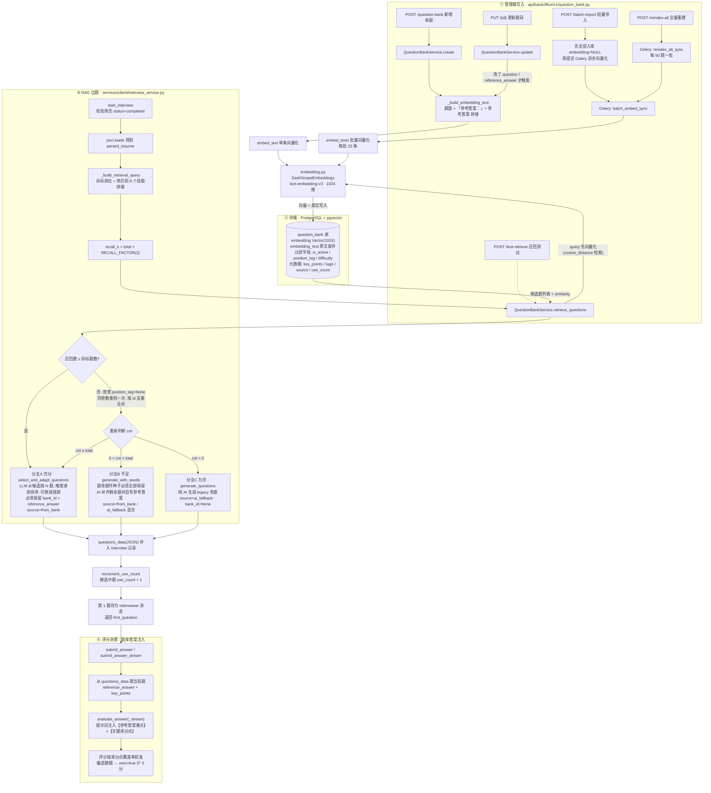

# 题库 RAG 代码逻辑图

> 范围：**题库 RAG**（`question_bank` 表 + pgvector 检索 + 出题/评分消费），不含知识库 RAG（`knowledge_*` 表 / Milvus 那条链路）。
> 向量化模型两边共用同一个 DashScope `text-embedding-v3`（1024 维），但存储与检索完全独立。

## 总逻辑图

## 检索 SQL 细节（`retrieve_questions`）

| 环节 | 实现 |
|---|---|
| query 向量化 | `embed_text(query)`，与入库同一模型 |
| 相似度 | pgvector `embedding.cosine_distance(query_vec)` |
| 阈值 | `distance ≤ 1 - QUESTION_BANK_MIN_SCORE(0.7)`，即相似度 ≥ 0.7 |
| 过滤 | `is_active = true`、`embedding IS NOT NULL`、`position_tag.contains(目标岗位)`（contains 模糊匹配）、`difficulty = 请求难度` |
| 排序/截断 | `ORDER BY distance LIMIT k`（k = 题数 × 2） |
| 返回 | `{id, category, position_tag, difficulty, question, reference_answer, key_points, similarity, source: from_bank}` |

## 关键参数（`app/core/config.py`）

- `QUESTION_BANK_MIN_SCORE = 0.7` —— 相似度门槛，低于不召回
- `QUESTION_BANK_RECALL_FACTOR = 2` —— 召回倍数（要 10 题先检 20 条）
- `QUESTION_BANK_TOP_K = 20` —— 管理端召回测试默认 k

## 文件地图

| 环节 | 文件 |
|---|---|
| 管理端 API（CRUD / 批量导入 / 重建 / 召回测试） | `ai-interview-backend/app/api/backoffice/v1/question_bank.py` |
| 题库服务（向量化时机 + pgvector 检索） | `ai-interview-backend/app/services/backoffice/question_bank_service.py` |
| 表模型 | `ai-interview-backend/app/models/question_bank.py` |
| Embedding 封装（DashScope，25 条/批） | `ai-interview-backend/app/services/common/embedding.py` |
| RAG 出题编排（query 构造 + 三分支） | `ai-interview-backend/app/services/client/interview_service.py` |
| LLM 出题三分支 + 评分注入 | `ai-interview-backend/app/services/client/ai_service.py` |
| Celery 异步向量化任务 | `ai-interview-backend/app/schedule/jobs/knowledge_tasks.py` |
